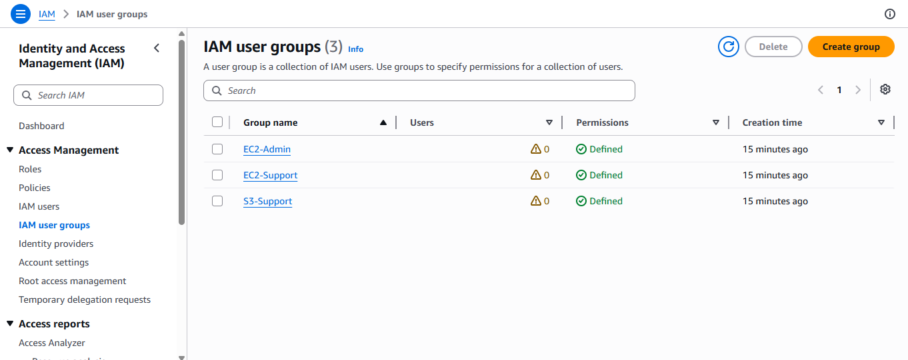
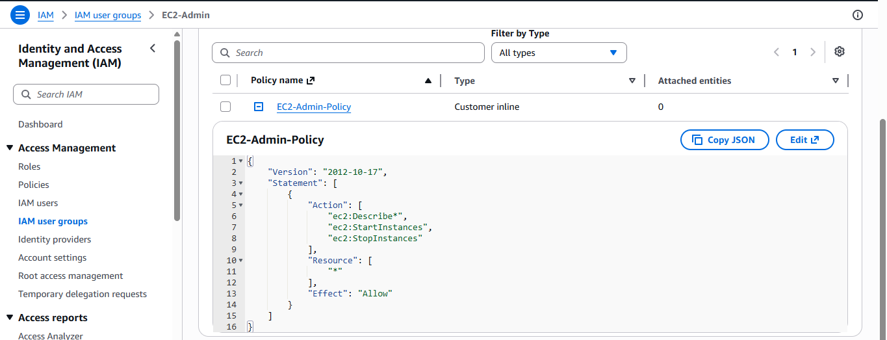
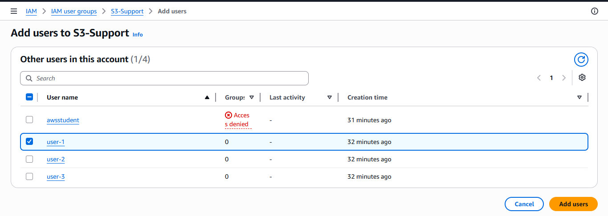
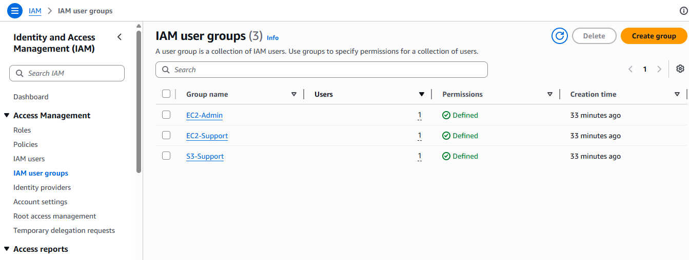
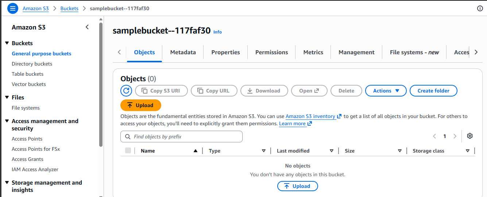
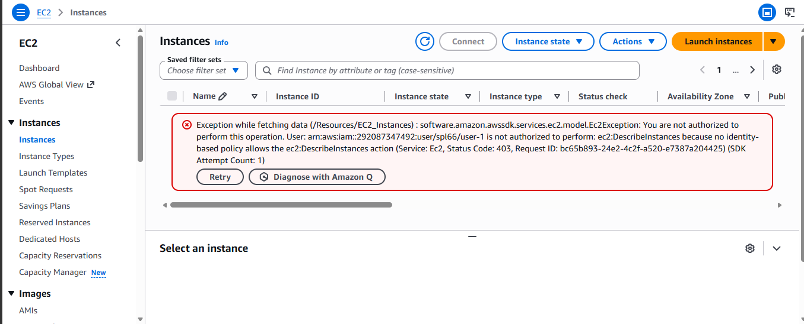
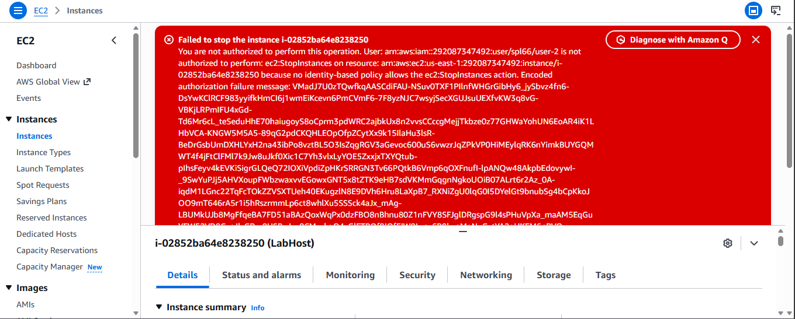
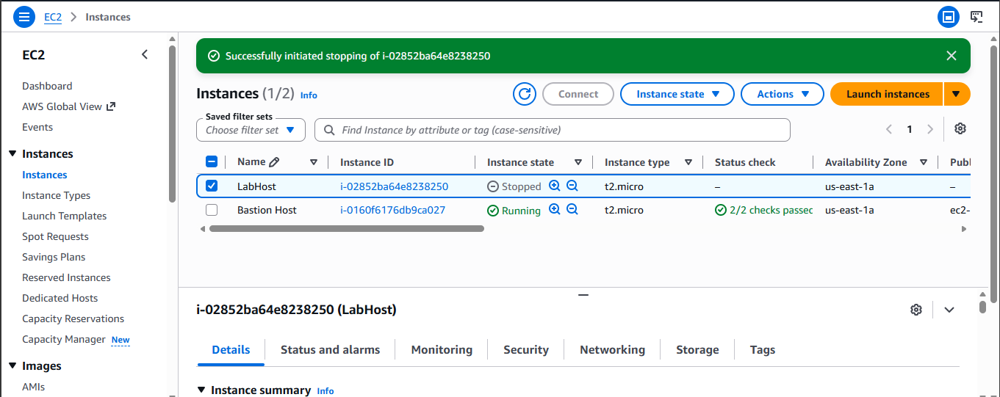

# Lab 01 — AWS IAM (Identity and Access Management)

Part of AWS Academy Cloud Foundations.

## Overview
This lab explores how AWS IAM controls access to resources using Users, 
Groups, and Policies. I worked through a business scenario where three 
staff members needed different levels of access depending on their job 
function — S3 support, EC2 support, and EC2 admin.

## Business Scenario
| User | Group | Permissions |
|------|-------|-------------|
| user-1 | S3-Support | Read-only access to S3 |
| user-2 | EC2-Support | Read-only access to EC2 |
| user-3 | EC2-Admin | View, start, and stop EC2 instances |

## What I Did

**1. Explored existing Users and Groups**
Checked each user's starting permissions (none, by default) and reviewed 
the three pre-built groups. Noticed that EC2-Support and S3-Support used 
**Managed Policies** (reusable, AWS or admin-built), while EC2-Admin used 
an **Inline Policy** (a one-off policy tied to a single group).

**2. Added each user to their correct group**
Assigned user-1 → S3-Support, user-2 → EC2-Support, user-3 → EC2-Admin, 
based on the business scenario above.

**3. Tested permissions by signing in as each user**
Logged in as each user in a private browser session to confirm the 
policies actually worked as intended — not just configured correctly, 
but enforced.

- **user-1 (S3-Support):** could view S3 bucket contents ✅, but got an 
  "unauthorized" error when trying to access EC2 ❌
- **user-2 (EC2-Support):** could view EC2 instances ✅, but the attempt 
  to stop an instance was blocked ❌
- **user-3 (EC2-Admin):** could view and successfully stop the EC2 
  instance ✅

## What I Learned
- Users don't need direct permissions — they inherit access through 
  group membership, which makes managing permissions at scale much easier
- **Managed Policies** are reusable across multiple users/groups, while 
  **Inline Policies** are tied to one specific group or user
- A policy statement is built from **Effect** (Allow/Deny), **Action** 
  (the API calls permitted), and **Resource** (what it applies to)
- Permissions aren't just configuration — they're actively enforced. 
  Testing this by logging in as each user made the concept of 
  least-privilege access concrete rather than theoretical
